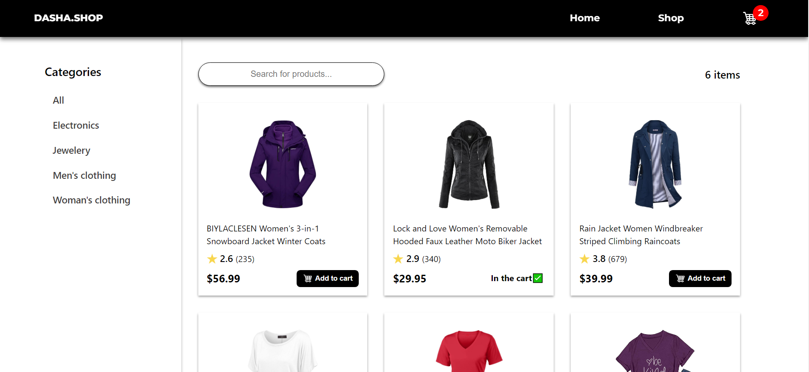
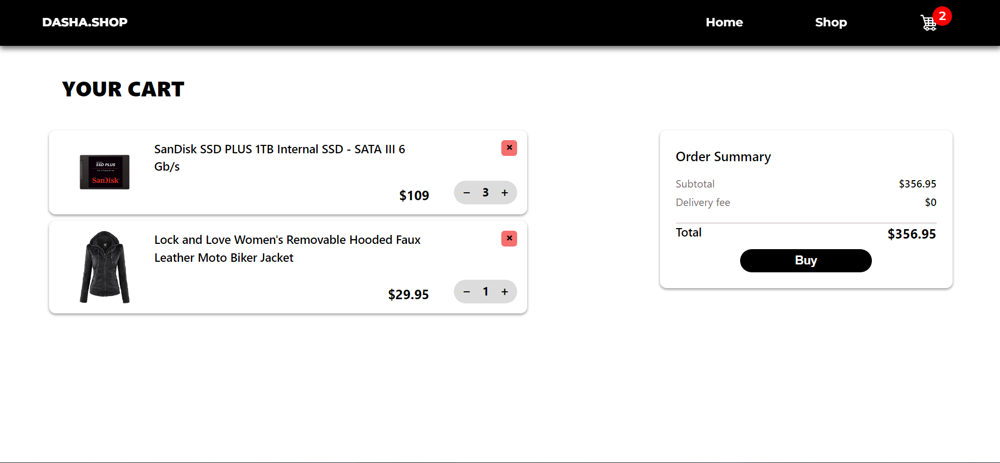

# Shopping cart

## This is my latest pet project that reflects my current knowledge and abilties.
It was created as part of [The Odin Project](https://www.theodinproject.com) course. 

The main goal of this project was to build a fake store using React, focusing on hooks such as useState, useContext, useMemo, and useCallback. The app allows users to browse products, add items to their cart, and adjust item quantities. The cart dynamically updates the total price based on the selected items and their quantities. Users can also remove items from the cart, and the system ensures that the cart contents and total are recalculated in real time. The project incorporates product filtering by category and search functionality. Once the user completes their selection, they can finalize the purchase, and the cart is reset.

## Live Demo
You can view the live version of the project [here](https://shopping-cart-vlad-petruks-projects.vercel.app/).

## Skills Practiced
- React Hooks: Used useState, useContext, useMemo, and useCallback for state management and performance optimization.
- State Management: Managed cart items, quantities, and real-time updates using React's state and context.
- Dynamic Product Filtering: Implemented search functionality for easy product browsing.
- Responsive Design: Styled components with CSS for a responsive, user-friendly interface.
- API Integration: Fetched and displayed product data from an external API.

## Screenshots

